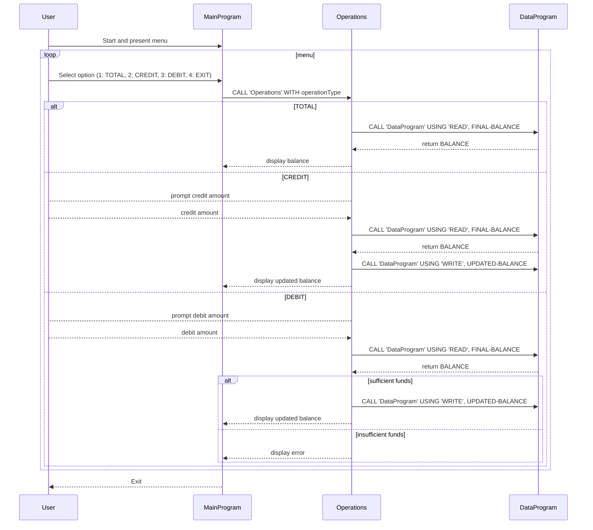

# Githublab4 COBOL Project Documentation

## Overview
This project is a simple COBOL-based account management system for student accounts.
It runs a menu-based flow in `main.cob`, with operation logic in `operations.cob`, and in-memory persistence in `data.cob`.

## Files

### `src/cobol/main.cob`
- Purpose: User interface loop and menu selection.
- Core behavior:
  - Displays options: View Balance, Credit Account, Debit Account, Exit.
  - Accepts user choice and routes to operations using `CALL 'Operations'`.
  - Continues until user selects Exit.
- Notes: Keep input as 1-4; invalid options are rejected.

### `src/cobol/operations.cob`
- Purpose: Business logic for account operations.
- Key operations:
  - `TOTAL`: `CALL 'DataProgram' USING 'READ', FINAL-BALANCE` and display balance.
  - `CREDIT`: read amount, read balance, add amount, write balance, display updated balance.
  - `DEBIT`: read amount, read balance, check sufficient funds, subtract amount and write, or display insufficient funds.
- Linkage: `PASSED-OPERATION` param from main program.
- Storage: `FINAL-BALANCE` holds working balance (initial 1000.00 in variable, but persisted by DataProgram layer).

### `src/cobol/data.cob`
- Purpose: In-memory account balance storage and read/write interface.
- Key procedure behavior:
  - `READ`: returns currently stored balance in `BALANCE` argument.
  - `WRITE`: updates stored `STORAGE-BALANCE` with `BALANCE` argument.
- Note: This program acts as a simple data adapter; no disk persistence.

## Business Rules (Student Accounts)

1. Starting balance is implicitly 1000.00 via `FINAL-BALANCE` and/or `STORAGE-BALANCE` defaults.
2. View Balance (`TOTAL`) always returns the latest balance from `DataProgram`.
3. Credit amount must be entered as numeric value; added directly to balance.
4. Debit amount requires `FINAL-BALANCE >= AMOUNT` for success; otherwise, operation is rejected and original balance remains.
5. No negative balances allowed.
6. All CRUD is in-session only (no file/database persistence).

## Usage
1. Build/compile via COBOL compiler with these three sources.
2. Run `MainProgram`.
3. Use menu options as directed.

## Extension ideas
- Add records for multiple student accounts in `data.cob`.
- Add transaction logging and persistence to a file.
- Add validation for non-numeric or invalid amount input.

## Sequence Diagram (Mermaid)

